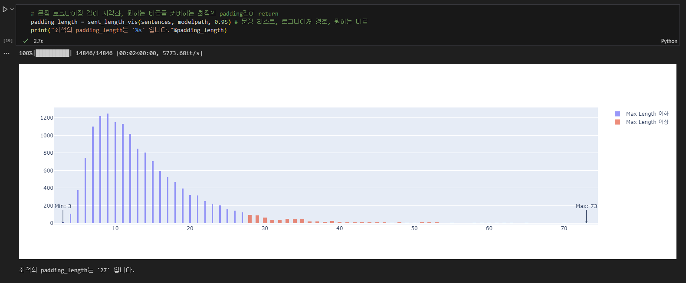
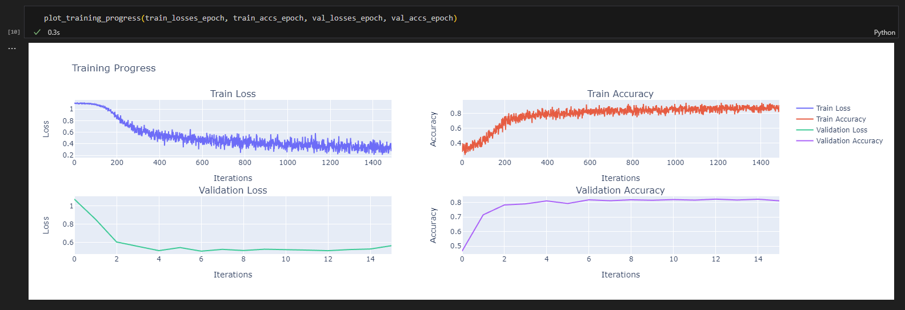

# Sentiment_Analysis
🌳NIFoS Datascience

Korean Text Multi-Classification Process
### Set up

    git clone git@github.com:DDalaDDula/NIFoS_Sentiment_Analysis.git
    cd NIFoS_Sentiment_Analysis

---
### Environment

    conda env create -f NIFOS.yaml
    conda activate NIFOS

---
**ELECTRA** (**E**fficiently **L**earning an **E**ncoder that **C**lassifies **T**oken **R**eplacements **A**ccurately)란 ICLR(**I**nternational **C**onference on **L**earning **R**epresentations) 2020에서 GOOGLE RESEARCH 팀이 발표한 Language Model 입니다. 해당 모델은 새로운 pre-training(사전학습) 기법이 적용되었습니다.

GAN (Generative Adversarial Network) 기반의 모델로, 대체된 토큰을 감지하는 것이 주된 목표입니다.

**ELECTRA**모델은 학습 효율을 향상시키기 위해 **R**eplaced **T**oken **D**etection (**RTD**)이라는 새로운 pre-training Task를 제안하며 보다 빠르고 효과적으로 학습할 수 있습니다. **ELECTRA**모델은 결과적으로 모델의 크기, 데이터, 컴퓨팅 리소스가 동일한 조건에서 기존 [**GOOGLE BERT**](https://github.com/google-research/bert) 모델의 성능을 능가하였습니다. 

다중분류에 사용된 모델은 monologg님의 [**koELECTRA**](https://github.com/monologg/KoELECTRA/tree/master)모델입니다. **koELECTRA**는 ELECTRA 모델을 한국어 자연어 처리 작업에 적용할 수 있도록  한국어 텍스트 데이터를  대규모로 pre-training(사전학습)시킨 모델입니다.

이번 3진 분류에 활용된 모델은 koELECTRA의 [**koelectra-base-v3-discriminator**](https://huggingface.co/monologg/koelectra-base-v3-discriminator)모델로, 34GB의 한국어 Corpus(뉴스, 위키, 나무위키, 신문, 문어, 구어, 메신저, 웹)를 학습한 모델입니다.

### **About KoELECTRA**

|  | Layers | Embedding Size | Hidden Size | # heads |
| --- | --- | --- | --- | --- |
| KoELECTRA-Base | Discriminator | 12 | 768 | 768 |
|  | Generator | 12 | 768 | 256 |

### **Pretraining Details**

| Model | Batch Size | Train Steps | LR | Max Seq Len | Generator Size | Train Time |
| --- | --- | --- | --- | --- | --- | --- |
| Base v3 | 256 | 1.5M | 2e-4 | 512 | 0.33 | 14d |

`Batch size`와 `Train steps`을 제외하고는 원 논문의 **Hyperparameter**와 동일합니다.

출처 = ELECTRA: Pre-training Text Encoders as Discriminators Rather Than Generators - https://openreview.net/pdf?id=r1xMH1BtvB

출처 = KoELECTRA Github - https://github.com/monologg/KoELECTRA/tree/master

출처 = koelectra-base-v3-discriminator Huggingface - https://huggingface.co/monologg/koelectra-base-v3-discriminator

---
### 3진 분류를 위한 Fine-Tunning & Learning Process

python 3.7.16 

transformers==2.1.1

pytorch==1.13.1

RTX A4000 / CUDA 10.0

**AdamW** 최적화 알고리즘을 사용했으며, 학습에서의 정체를 방지하기 위해 모델의 **lr**(Learning Rate)을 **2e-4**(KoELECTRA) 에서 **5e-6**으로 변경하였습니다.(나중에 REDUCELRONPLATEAU 함수 적용해서 변경해야 함)

긍정/부정/중립 분리를 학습하기 위해 각각 긍정 또는 부정 또는 중립으로 라벨링된 한국어 corpus 약 59만개를 추가학습하였습니다.(평서문, 대화체, sns체 등)

효율적인 padding 길이를 산정할 수 있도록, **./learning/__init__.py** 파일에 **dataset_split** 함수를 정의하였습니다.

overfitting을 방지하기 위해 dropout은 처음부터 **0.2**로 설정되도록 하였습니다.

**koelectra-base-v3-discriminator** 모델은 **ElectraForSequenceClassification** 모델로 불러왔습니다. 
**ElectraForSequenceClassification**는 Hugging Face의 Transformers 라이브러리에서 제공되는 사전 훈련된 **ELECTRA** 모델을 기반으로 한 문장 분류(Classification) 모델입니다. **ElectraForSequenceClassification**모델은 ELECTRA 모델의 사전 훈련된 가중치를 활용하여 텍스트 데이터에서 특성을 추출하고, 그 다음에 특정 분류 작업에 맞게 추가로 학습되는 레이어를 포함하고 있습니다. 이러한 레이어는 주어진 입력 문장을 분류하기 위한 최종 출력을 생성합니다.

---
### 모델 구조

1. **ElectraModel**: Electra의 기본 Transformer 모델으로 주어진 입력 텍스트를 표현하는데 사용됩니다.
    - ElectraEmbeddings: 토큰들을 임베딩하는 부분으로, 토큰, 위치, segment(문장의 구분) 임베딩을 결합하여 토큰의 의미적인 표현을 생성합니다.
    - ElectraEncoder: 여러 개의 ElectraLayer쌓은 형태로 구성되어 있으며, 입력 텍스트의 인코딩과 셀프 어텐션 메커니즘을 활용하여 텍스트를 임베딩합니다.
    - ElectraLayer: 각 레이어는 Multi-Head Self Attention과 Feed-Forward Neural Network등을 통해 입력 텍스트의 문맥과 의미를 이해함.
       
2. **ElectraClassificationHead**: 이 부분은 ElectraModel의 출력을 이용하여 텍스트 분류를 수행합니다.
    - dense: 입력 임베딩을 768차원으로 변환하는 fully connected 선형 레이어입니다
    - out_proj: 768차원의 벡터를 3개의 클래스(긍정, 부정, 중립)으로 mapping하는 선형 레이어입니다

최종적으로 모델은, 입력 텍스트의 시퀀스를 3개의 클래스중 하나로 분류하여 해당 텍스트가 어떤 카테고리에 속하는지를 예측합니다.

---
### 시각화 파일(예시)

**dataset_split** 함수 실행 시, sentence를 tokenizing 하여 시각화합니다. 원하는 비율을 설정하여 최적의 **padding_length**를 도출시킬 수 있습니다. (**Plotly**)

**plot_training_progress** 함수 실행 시, **train_with_early_stopping**함수를 통한 모델의 학습과정을 시각화합니다. (**Plotly**)

